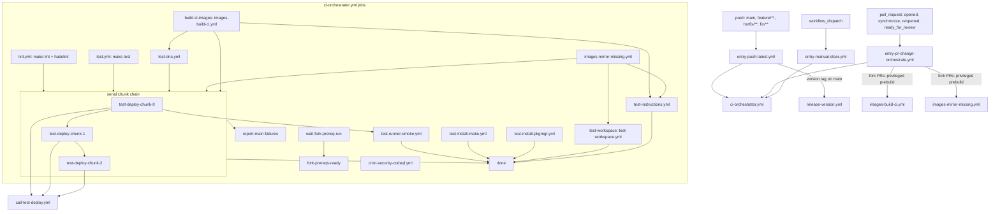
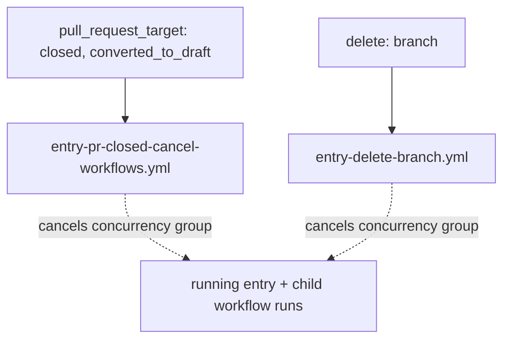
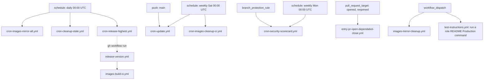

# Workflow Dependency Map

How the workflows under `.github/workflows/` trigger and call each other.
Solid arrows: `workflow_call` (`uses:`) or job `needs`. Dotted arrows:
indirect coupling (CLI dispatch, shared concurrency group). Per-workflow
inputs and descriptions: [workflows.md](../../docs/contributing/tools/github/actions/workflows.md).

## CI pipeline



## Sweeps and chunks

A **sweep** is one orchestrator run. It builds a single ordered list of
`role#variant` rows, assigns each row a deploy mode and a tor state, and
deploys the list in serial **chunk** blocks.

### Why chunks exist

GitHub cancels a job that has sat queued for 24 hours. That clock starts when
the job is queued, not when the run starts, and a `needs:` edge delays queueing
until the dependency completes. A run that queues its whole matrix at once
leaves the tail waiting past the cut, where it dies unrun. Deploying in chunks
chained on `needs:` restarts the clock per chunk.

The chunk size is what makes that safe, and `cli.meta.ci.slots` derives it
rather than pinning it:

```text
waves      = floor(INFINITO_CI_QUEUE_HOURS / the deploy job's timeout-minutes)
chunk size = INFINITO_CI_CONCURRENCY * waves
```

Assuming every job burns its full timeout is deliberately pessimistic — no job
can outlast it — so the estimate can only overshoot the real drain time. With
the current constants that is 4 waves of 20 runners, so 80 rows per chunk, and
the last job of a chunk starts around t=18h, well inside the 24h window.

### How many chunks a sweep spends

The run's 256-job cap is the second ceiling. `slots` counts every non-deploy
job the orchestrator chain spawns, subtracts the worst `entry-*.yml` overhead,
and what remains is `available` — the rows one sweep may deploy across all its
chunks. Rows beyond that roll into the next sweep, which starts reading the
regular line at an offset (`cli.meta.ci.chunks`), so consecutive sweeps walk
the whole list instead of re-testing the same head forever.

GitHub Actions cannot generate a variable number of jobs, so the chunk blocks
are written out in the orchestrator. `INFINITO_CI_MAX_CHUNKS` must equal how
many exist there — `slots` plans a sweep against that key, and a sweep planned
larger than the chain silently drops its tail. Blocks whose slice comes back
empty skip themselves and cost nothing.

Run `python -m cli.meta.ci.slots --matrix` to see the whole budget.

### Priority

`priority` names the roles that lead. They sort to the head of the list and the
split forces a chunk boundary at the priority/regular seam, so a chunk is
either all priority or all regular — the seam chunk stays short rather than
being topped up. That is what guarantees every priority row is deployed before
the first regular one starts. Priority rows wear a trailing `⭐` in their job
name and never move with the sweep offset.

They are also the rows a run must not sample. A priority row is deployed in
**every combination it can take** — each variant, in each mode its role offers,
and on the modes that carry the onion axis once behind Tor and once on
clearnet — all within the same sweep. A 3-variant role offering compose and
swarm therefore becomes 3 × 2 × 2 = **12 jobs**, not 3. That is the point of
naming a role in `priority`: it is proven everywhere at once instead of over
four sweeps.

An explicit `tor` input still wins over the full coverage: `enforced`,
`exclusive` and `disabled` are operator narrowings, and a variant that pins
`services.tor.enabled` to false never gets an onion run regardless.

### Mode and tor

For **regular** rows both axes are a deterministic rotation over the row's
position in the global list and the sweep number, never random, so a red job
reproduces by re-running the same sweep:

| Axis | Rotation |
|---|---|
| mode | `(position + sweep) % len(modes the role offers)` |
| tor | `(position + sweep // 2) % 2` |

A role offers at most two modes in practice — swarm needs its own stack, host
needs the absence of one — so a row flips between its two modes on consecutive
sweeps. Tor turns on `sweep // 2` so it does not flip in lockstep: a row walks
all four mode/tor combinations over four sweeps instead of only two. Priority
rows skip the rotation entirely and take the whole cross-product at once.

Because the same variant can now run twice in one sweep, the onion state is
part of what identifies a job: it is in the job label (`🧅` vs `🌐`), in the
deploy concurrency group, and in every artifact name. Two jobs uploading under
one artifact name is a conflict, not an overwrite.

### Stopping on failure

`chunk_gate` (default `true`) decides whether the chain stops at its first
failed chunk:

| Value | Behaviour |
|---|---|
| `true` | chunk 0 fails → the remaining chunks are skipped |
| `false` | every chunk deploys and reports; the run still ends red |

`skipped` counts as passed, so an empty chunk never blocks the chain. After
fixing what broke a sweep, `resume_from_chunk` re-enters at that index instead
of re-running the green chunks. Both are inputs on `entry-manual-steer.yml`;
the other entry points take the defaults.

## Cancellation



## Scheduled and standalone



Also manually dispatchable: `cron-images-mirror-all.yml`, `cron-images-cleanup-ci.yml`,
`cron-cleanup-stale.yml`, `cron-update.yml`, `cron-release-highest.yml`, `call-release-version.yml`,
`call-lint.yml`, `call-test.yml`, `call-test-dns.yml`,
`test-workspace.yml`, `test-runner-smoke.yml`.
