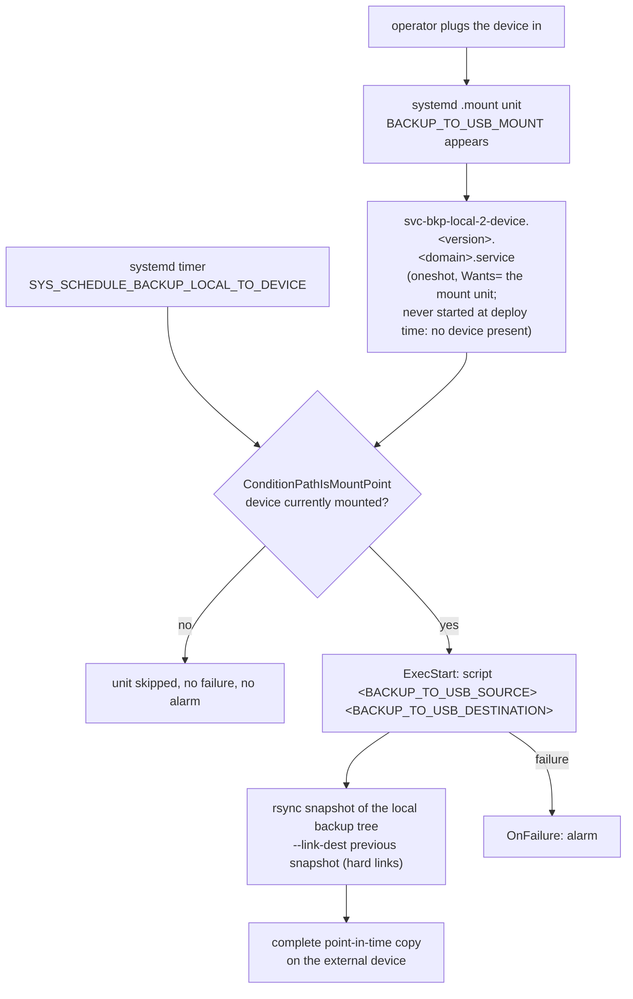

# Backup Local to Device

## Description

A plug-and-go backup of the local backup tree to an external block device (typically a swappable USB drive).
The transfer is hard-link deduplicated against the previous snapshot, so each plug-in yields a complete, browsable point-in-time copy without doubling disk usage.

## Overview

This role asserts that the mount, source, and target configuration values are present, deploys the rsync-driver script, and installs a systemd mount unit plus a oneshot service.
The oneshot service is triggered automatically when the configured mount path appears, so the only operator action is to physically plug the device in.

## Schema



## Features

- **Plug-triggered:** a systemd `.mount` unit fires the backup service the moment the device appears, so backups happen without an interactive command.
- **Snapshot-aware:** rsync `--link-dest` against the previous snapshot keeps storage growth proportional to actual change.
- **Configuration-asserted:** missing mount/source/target values fail the deploy early, before any partial state lands.
- **Idempotent:** repeated plug-ins re-use existing snapshots and only sync deltas.

## Recover

Run `files/recover.py` on the host with the backup device attached:

```
recover.py /dev/sdX1 /mnt/usb-recover /var/lib/infinito/backup [--snapshot <timestamp>]
```

The script opens the LUKS device (interactive passphrase prompt; `--passphrase-stdin` for automation), mounts it, picks the newest device snapshot across every machine hash (a fresh host after total loss has a new machine id), mirrors it into the target (`rsync -a --delete`) and unmounts/closes the device again. No pre-recover service backup runs: the device itself is the backup this role maintains. Afterwards restore individual applications from the backup root with the matching role's `recover.py` (`svc-bkp-volume-2-local` for docker volumes, `svc-bkp-nfs-2-local` for NFS exports).

## Credits

Implemented by **[Kevin Veen-Birkenbach](https://www.veen.world)**.
Part of the [Infinito.Nexus Project](https://s.infinito.nexus/code) and maintained by [Kevin Veen-Birkenbach](https://www.veen.world).
Licensed under the [Infinito.Nexus Community License (Non-Commercial)](https://s.infinito.nexus/license).
