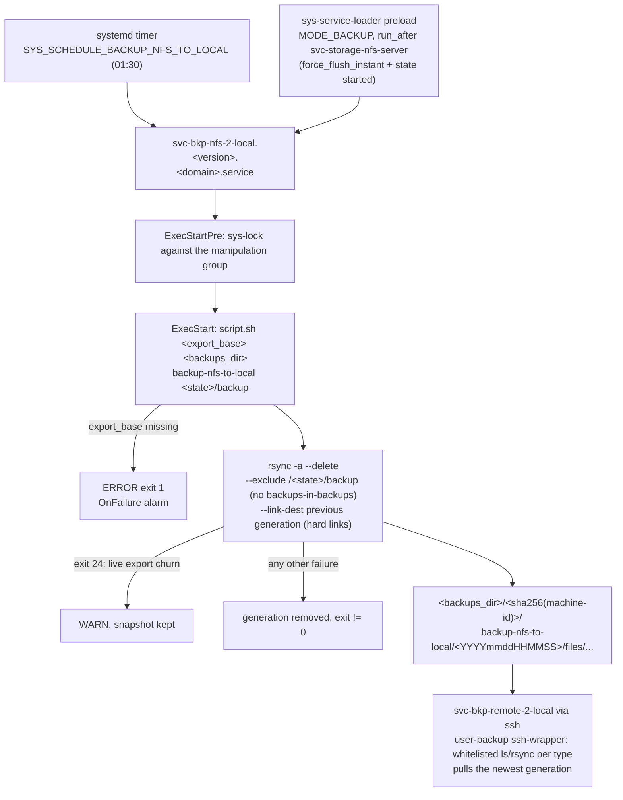

# Backup NFS to Local

## Description

A scheduled differential backup of the NFS export onto the local backup directory.
Each run stores a discrete snapshot under `<backups>/<machine-hash>/backup-nfs-to-local/<generation>/files/`, hard-linked against the previous generation via rsync `--link-dest`.

## Overview

This role installs the backup script and the systemd service that drives it on the configured schedule (`SYS_SCHEDULE_BACKUP_NFS_TO_LOCAL`), and serialises the run against the rest of the manipulation group via [sys-lock](../sys-lock/).
The source path is the NFS export base resolved from the [svc-storage-nfs-server](../svc-storage-nfs-server/) services SPOT; deploy the role on the host that serves the export.
Deploy [sys-ctl-cln-bkps](../sys-ctl-cln-bkps/) to keep the snapshot tree bounded and [user-backup](../user-backup/) so downstream hosts can pull the tree.

## Schema



## Features

- **Differential snapshots:** rsync `--link-dest` against the previous generation deduplicates unchanged files.
- **Baudolo-compatible layout:** snapshots land in the same `<machine-hash>/<repo>/<generation>` tree as the container backups, so pull and cleanup tooling applies unchanged.
- **Schedule-coordinated:** the systemd unit is part of the global manipulation group, so it never races backup/cleanup/repair jobs on the same host.

## Recover

Run `files/recover.py` on the host that serves the NFS export:

```
recover.py <backups>/<machine-hash>/backup-nfs-to-local/<generation>/files/<state>/<volume> <export-base>/<state>/<volume>
```

1. Stop every stack consuming the subtree: `docker stack rm <stack>`.
2. Run the script; it first starts the role's deployed backup unit (a fresh differential `backup-nfs-to-local` generation of the live export), then mirrors the snapshot into the target (`rsync -a --delete`, with the shared `<state>/backup` root protected from deletion and never copied in). `--no-service-backup` skips the unit run when the target holds nothing worth saving.
3. Redeploy the stack; the NFS clients re-mount and pick up the restored state.

The target subtree must already exist; the script refuses to create export subtrees implicitly.

## Credits

Implemented by **[Kevin Veen-Birkenbach](https://www.veen.world)**.
Part of the [Infinito.Nexus Project](https://s.infinito.nexus/code) and maintained by [Kevin Veen-Birkenbach](https://www.veen.world).
Licensed under the [Infinito.Nexus Community License (Non-Commercial)](https://s.infinito.nexus/license).
