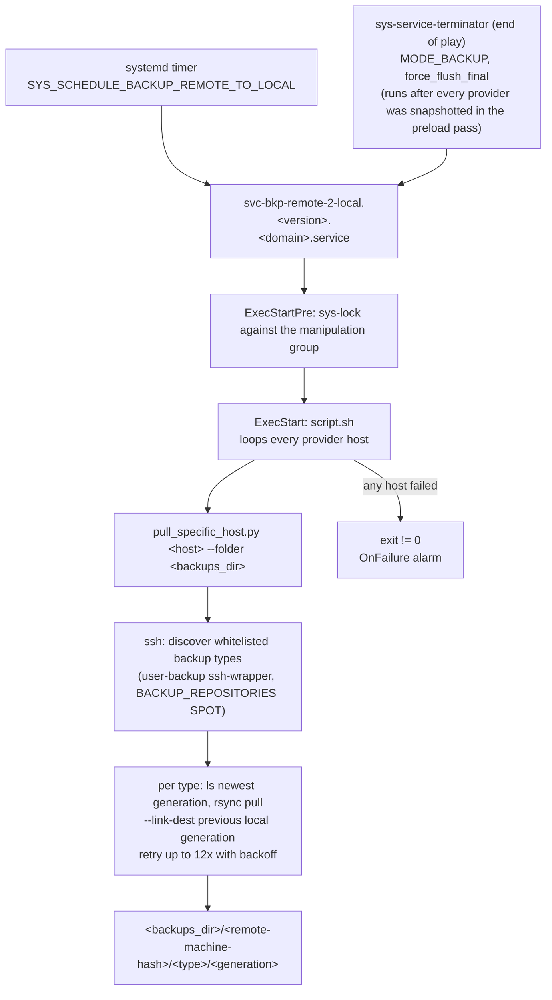

# Backup Remote to Local

## Description

A scheduled pull-style backup that replicates the backup trees of one or more remote provider hosts onto this host via SSH + rsync.
The receiving side is the trust anchor: each retrieval is a discrete snapshot, hard-linked against the previous one, with a retry loop guarding against transient network failures.

## Overview

This role deploys the Python pull script that talks to each remote provider, installs the systemd service that drives it on the configured schedule (`SYS_SCHEDULE_BACKUP_REMOTE_TO_LOCAL`), and serialises the run against the rest of the manipulation group via `sys-lock`.
The remote side must expose a chrooted SSH/SFTP endpoint that publishes its backup tree: deploy [user-backup](../user-backup/) for the chrooted pull account and [sys-ctl-cln-bkps](../sys-ctl-cln-bkps/) to keep the published tree bounded.

## Schema

## Features

- **Pull-only trust model:** the local host owns the SSH session; provider hosts never gain credentials on this side.
- **Retry-with-backoff:** transient SSH/rsync failures retry up to twelve times across a long window before surfacing as a hard failure.
- **Snapshot-aware:** rsync `--link-dest` against the previous local snapshot deduplicates unchanged files.
- **Schedule-coordinated:** the systemd unit is part of the global manipulation group, so it never races backup/cleanup/repair jobs on the same host.

## Recover

This role's direction is one-way by design (`files/recover.py.nocheck`): it pulls provider backups onto this host, so the pulled tree under `<backups>/<machine-hash>/<repo>/<generation>/` IS the recovery store and there is no live target here to restore into.

To recover a source system, transfer the wanted generation to it (the provider's `backup` user only whitelists pull commands, so pushing requires an explicit operator rsync with a root-capable target) and run the matching role's `recover.py` there (`svc-bkp-volume-2-local` for docker volumes, `svc-bkp-nfs-2-local` for NFS exports).

## Further Resources

- [How I backup dedicated root servers](https://blog.veen.world/2020/12/26/how-i-backup-dedicated-root-servers/)

## Credits

Implemented by **[Kevin Veen-Birkenbach](https://www.veen.world)**.
Part of the [Infinito.Nexus Project](https://s.infinito.nexus/code) and maintained by [Kevin Veen-Birkenbach](https://www.veen.world).
Licensed under the [Infinito.Nexus Community License (Non-Commercial)](https://s.infinito.nexus/license).
