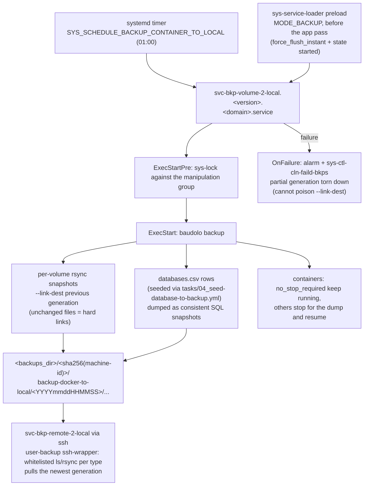

# Backup Container to Local

## Description

A scheduled, deduplicating backup of every Docker container's data on this host to a local backup directory.
File payloads are captured with rsync hard-link snapshots; databases register themselves into a central seed file so each backup run also dumps a consistent SQL snapshot via [baudolo](https://github.com/kevinveenbirkenbach/backup-docker-to-local).

## Overview

This role installs the `baudolo` CLI, lays out the on-host backup tree, deploys the systemd service that drives the periodic run, and wires the cleanup-of-failed-backups dependency so partial snapshots are not retained.
Database seeding for individual apps is contributed by the consumer roles via `tasks/04_seed-database-to-backup.yml`, which they include conditionally once `svc-bkp-volume-2-local` is in `group_names`.

## Schema



## Features

- **Per-container snapshots:** rsync `--link-dest` snapshots deduplicate unchanged files across runs.
- **Database-aware:** consumer apps seed their connection metadata into a central `databases.csv`, so the same run can dump SQL state alongside the file payload.
- **Live-aware:** containers tagged `no_stop_required` stay running during the dump; others stop briefly and resume.
- **Systemd-driven:** a generated unit fires on the configured schedule (`SYS_SCHEDULE_BACKUP_CONTAINER_TO_LOCAL`), serialised against other backup/cleanup/repair groups by `sys-lock`.
- **Self-cleaning:** failed backup attempts are torn down by `sys-ctl-cln-faild-bkps` so a broken run cannot poison the next.

## NFS-backed volumes

When a host runs Docker Swarm with NFSv4-backed shared volumes
(see [svc-storage-nfs-server](../svc-storage-nfs-server/) and
[svc-storage-nfs-client](../svc-storage-nfs-client/)), the backup
machinery operates transparently against the existing
`/var/lib/docker/volumes/<vol>/_data` mount paths: the Linux
kernel routes the I/O over NFS instead of the local
filesystem. The rsync hard-link semantics still apply, but with
two caveats:

- **Source-of-truth.** Take backups from the NFS server itself, or
  from a single designated swarm node, NOT from every node. The
  same data is visible from every node, but running multiple
  parallel backups against the same export wastes I/O and may
  race on the `link-dest` target.
- **Snapshot consistency.** For DB data directories that stay
  local-only,
  the existing `databases.csv` SQL-dump path is unchanged. For
  NFS-backed file volumes (e.g. MediaWiki `images/`), point the
  backup directly at the NFS export base on the server side for
  faster snapshots than going through the docker volume.

Restore procedure for an NFS-backed volume: stop the consuming
stack on the swarm manager (`docker stack rm <stack>`), rsync
the desired backup snapshot into the NFS export subdirectory,
re-deploy the stack. The docker volume's NFS driver remounts on
re-deploy and picks up the restored state.

## Recover

Run `files/recover.py` on the backed-up host to restore a volume's files:

```
recover.py <backups>/<machine-hash>/backup-docker-to-local/<generation>/<volume>/files <volume>
```

1. Stop the consuming project (`docker compose down` / `docker stack rm <stack>`).
2. Run the script; it first starts the role's deployed backup unit (a fresh differential baudolo generation of every volume and database), resolves the volume's mountpoint and mirrors the snapshot into it (`rsync -a --delete`). `--no-safety-backup` skips the unit run when the target holds nothing worth saving.
3. Restore databases with `baudolo-restore postgres|mariadb ...`, then start the project again; on swarm, NFS-backed volumes are restored via `svc-bkp-nfs-2-local`'s `recover.py` instead (see below).

## Credits

Implemented by **[Kevin Veen-Birkenbach](https://www.veen.world)**.
Part of the [Infinito.Nexus Project](https://s.infinito.nexus/code) and maintained by [Kevin Veen-Birkenbach](https://www.veen.world).
Licensed under the [Infinito.Nexus Community License (Non-Commercial)](https://s.infinito.nexus/license).
