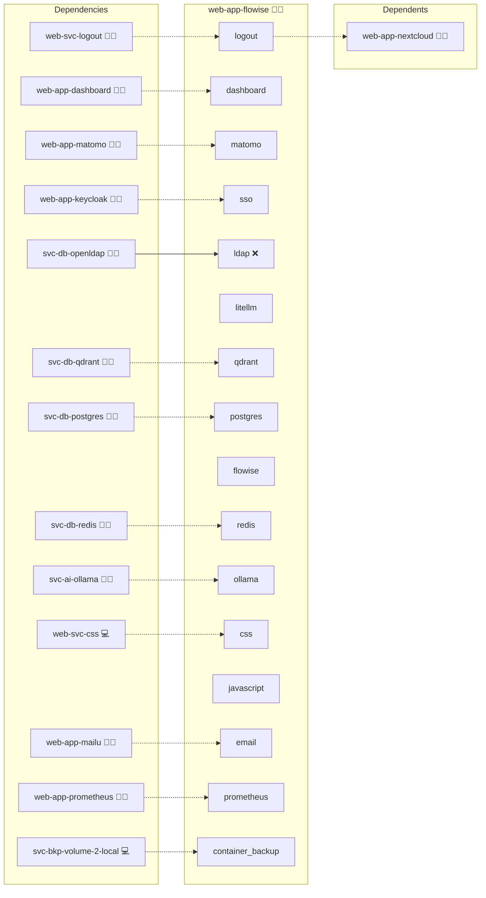

# Flowise

## Description

**Flowise** is a visual builder for AI workflows. Create, test, and publish chains that combine LLMs, your documents, tools, and vector search, without writing glue code.

## Overview

Users design flows on a drag-and-drop canvas (LLM, RAG, tools, webhooks), test them interactively, and publish endpoints that applications or bots can call. Flowise works well with local backends such as **Ollama** (directly or via **LiteLLM**) and **Qdrant** for retrieval.

## Cosmos

The diagram places Flowise in the Infinito.Nexus cosmos: the components it deploys (capabilities), the central services it consumes (dependencies), and its outward reach (federation and bridged external networks).



## Features

* No/low-code canvas to build assistants and pipelines
* Publish flows as HTTP endpoints for easy integration
* Retrieval-augmented generation (RAG) with vector DBs (e.g., Qdrant)
* Pluggable model backends via OpenAI-compatible API or direct Ollama
* Keep data and prompts on your own infrastructure

## Quick Setup

### Development

Clone, set up the workstation, and deploy Flowise onto the local stack:

```bash
git clone https://github.com/infinito-nexus/core.git
cd core
make onboard
make compose-deploy mode=reinstall apps=web-app-flowise full_cycle=false
```

### Production

Run the published image to provision the inventory and deploy Flowise to a managed server (the mounted volume persists the inventory between the two runs):

```bash
docker run --rm -it \
  -v "$PWD/inventories:/etc/infinito.nexus/inventories" \
  ghcr.io/infinito-nexus/core/debian \
  infinito administration inventory provision /etc/infinito.nexus/inventories/prod \
  --inventory-file /etc/infinito.nexus/inventories/prod/devices.yml \
  --host <your-server> \
  --vars-file inventories/<env>/default.yml \
  --include 'web-app-flowise'

docker run --rm -it \
  -v "$PWD/inventories:/etc/infinito.nexus/inventories" \
  ghcr.io/infinito-nexus/core/debian \
  infinito administration deploy dedicated /etc/infinito.nexus/inventories/prod/devices.yml \
  --password-file /etc/infinito.nexus/inventories/prod/.password \
  --id web-app-flowise \
  --diff \
  -vv
```

## Further Resources

* Flowise: [flowiseai.com](https://flowiseai.com)
* Qdrant: [qdrant.tech](https://qdrant.tech)
* LiteLLM: [litellm.ai](https://www.litellm.ai)
* Ollama: [ollama.com](https://ollama.com)

## Credits

Implemented by **[Kevin Veen-Birkenbach](https://www.veen.world)**.
Part of the [Infinito.Nexus Project](https://s.infinito.nexus/code) and maintained by [Kevin Veen-Birkenbach](https://www.veen.world).
Licensed under the [Infinito.Nexus Community License (Non-Commercial)](https://s.infinito.nexus/license).
