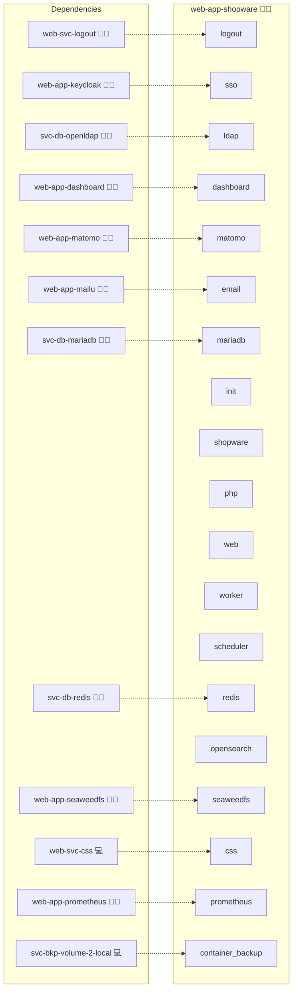

# Shopware

## Description

Empower your e-commerce vision with **Shopware 6**, a modern, flexible, and open-source commerce platform built on **Symfony and Vue.js**. Designed for growth and innovation, it enables seamless integration, outstanding customer experiences, and complete control over your digital business. Build, scale, and sell with confidence.

## Overview

This role deploys **Shopware 6** using **Docker**. It automates installation, migration, and configuration of your storefront, integrating with a central **MariaDB** database.
Optional components like **Redis** and **OpenSearch** enhance performance and search capabilities, while **OIDC** and **LDAP** support integration with centralized identity systems such as **Keycloak**.

With automated setup, update handling, variable management, and plugin-based authentication, this role simplifies the deployment and maintenance of your Shopware instance.

## Cosmos

The diagram places Shopware in the Infinito.Nexus cosmos: the components it deploys (capabilities), the central services it consumes (dependencies), and its outward reach (federation and bridged external networks).



## Features

* **Modern and Scalable:** A robust Symfony-based framework optimized for commerce innovation.
* **Automated Setup & Maintenance:** Installs, migrates, and configures Shopware automatically.
* **Extensible Architecture:** Optional Redis, OpenSearch, and plugin-based IAM integrations.
* **Centralized Database Access:** Connects seamlessly to the shared MariaDB service.
* **Integrated Configuration:** Environment and Docker Compose variables managed automatically.

## Quick Setup

### Development

Clone, set up the workstation, and deploy Shopware onto the local stack:

```bash
git clone https://github.com/infinito-nexus/core.git
cd core
make onboard
make compose-deploy mode=reinstall apps=web-app-shopware full_cycle=false
```

### Production

Run the published image to provision the inventory and deploy Shopware to a managed server (the mounted volume persists the inventory between the two runs):

```bash
docker run --rm -it \
  -v "$PWD/inventories:/etc/infinito.nexus/inventories" \
  ghcr.io/infinito-nexus/core/debian \
  infinito administration inventory provision /etc/infinito.nexus/inventories/prod \
  --inventory-file /etc/infinito.nexus/inventories/prod/devices.yml \
  --host <your-server> \
  --vars-file inventories/<env>/default.yml \
  --include 'web-app-shopware'

docker run --rm -it \
  -v "$PWD/inventories:/etc/infinito.nexus/inventories" \
  ghcr.io/infinito-nexus/core/debian \
  infinito administration deploy dedicated /etc/infinito.nexus/inventories/prod/devices.yml \
  --password-file /etc/infinito.nexus/inventories/prod/.password \
  --id web-app-shopware \
  --diff \
  -vv
```

## Further Resources

* [Shopware Official Website](https://www.shopware.com/en/) <!-- nocheck: url; redirect loop on probe, site is alive when visited interactively -->
* [Shopware Developer Documentation](https://developer.shopware.com/)
* [Shopware Store (Plugins)](https://store.shopware.com/en/)

## Credits

Implemented by **[Kevin Veen-Birkenbach](https://www.veen.world)**.
Part of the [Infinito.Nexus Project](https://s.infinito.nexus/code) and maintained by [Kevin Veen-Birkenbach](https://www.veen.world).
Licensed under the [Infinito.Nexus Community License (Non-Commercial)](https://s.infinito.nexus/license).
